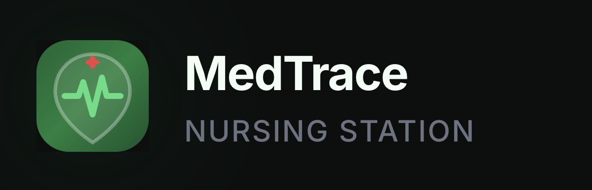
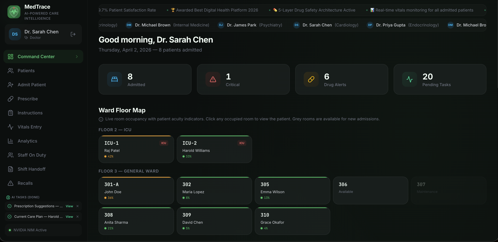
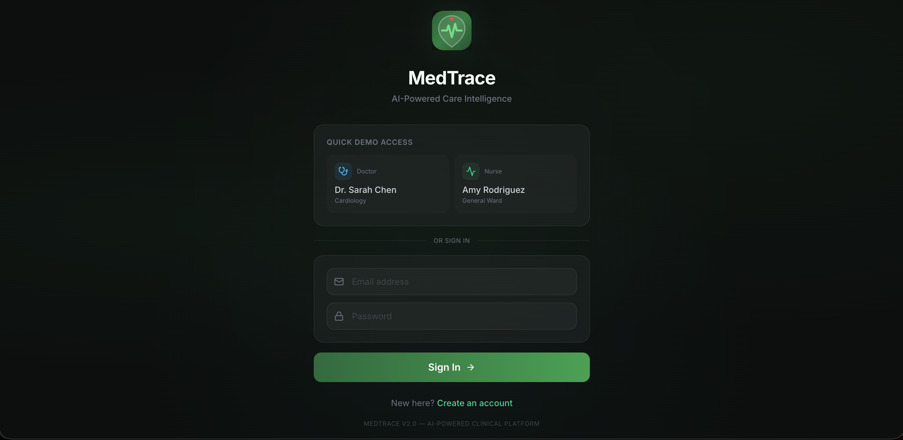
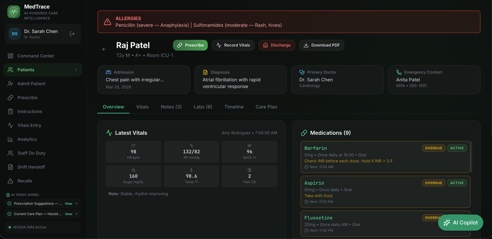
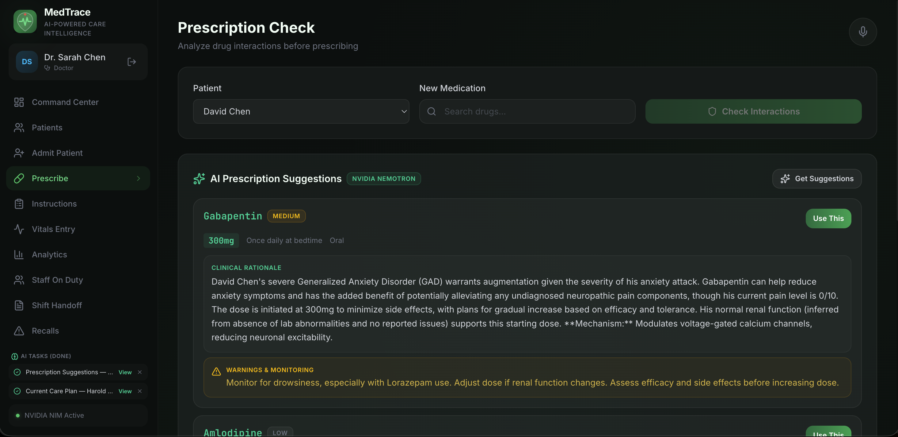
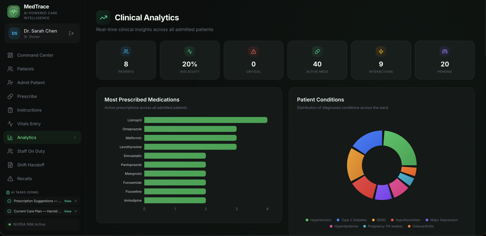
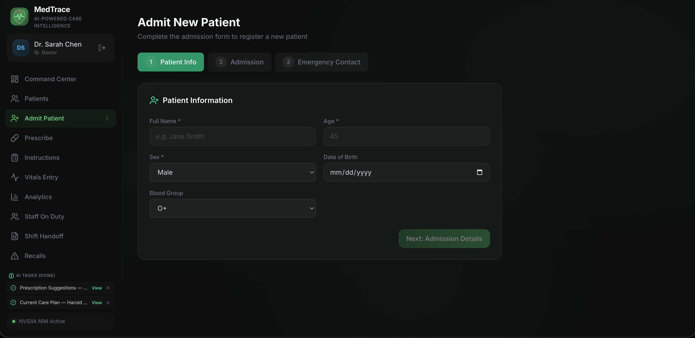

<p align="center">
  
</p>

<h1 align="center">MedTrace</h1>
<h3 align="center">AI-Powered Care Intelligence Platform</h3>

<p align="center">
  <strong>A comprehensive hospital management system with dual AI models, 5-layer drug safety architecture, real-time patient monitoring, and intelligent clinical decision support.</strong>
</p>

<p align="center">
  
  
  
  
  
  
</p>

---

<p align="center">
  
</p>

### Command Center (Dashboard)
<p align="center">
  
</p>
<p align="center"><em>Real-time ward overview with scrolling tickers, animated stat cards, floor map, and patient vitals</em></p>

<br/>

<p align="center">
  
  
</p>
<p align="center"><em>Left: Login with demo quick access &nbsp; | &nbsp; Right: Patient list with live vitals and search filtering</em></p>

<br/>

<p align="center">
  
  
</p>
<p align="center"><em>Left: AI prescription suggestions with 9-dimension safety analysis &nbsp; | &nbsp; Right: Clinical analytics with interactive charts</em></p>

<br/>

### Admit New Patient
<p align="center">
  
</p>
<p align="center"><em>3-step admission wizard with room assignment, doctor assignment, and emergency contact</em></p>

## Table of Contents

- [Overview](#overview)
- [Key Features](#key-features)
- [Architecture](#architecture)
- [Tech Stack](#tech-stack)
- [AI System](#ai-system)
- [Safety Architecture](#safety-architecture)
- [Pages & Modules](#pages--modules)
- [API Reference](#api-reference)
- [Database Schema](#database-schema)
- [Getting Started](#getting-started)
- [Deployment](#deployment)
- [Demo Access](#demo-access)
- [UI/UX Highlights](#uiux-highlights)
- [Project Structure](#project-structure)

---

## Overview

MedTrace is a full-stack hospital management and clinical decision support platform designed for modern healthcare workflows. It combines real-time patient monitoring, AI-powered care plan generation, comprehensive drug safety validation, and pharmacogenomic profiling into a single, unified system.

Built as a single Next.js application with zero external database dependencies, MedTrace runs entirely on SQLite with auto-seeding — making it deployable anywhere with zero configuration.

### What Makes MedTrace Different

- **Dual AI Model System** — Fast responses in 3-5 seconds + comprehensive reports in the background
- **5-Layer Drug Safety** — From toxic substance blocklists to AI-powered multi-dimension analysis
- **Pharmacogenomic Awareness** — Considers patient genetic profiles for drug metabolism
- **Zero-Config Setup** — No database server, no migrations, no seeds to run manually
- **Background AI Tasks** — Generate reports while navigating the app freely

---

## Key Features

### Patient Management
- Complete patient lifecycle: admission → monitoring → treatment → discharge
- Real-time vital signs with color-coded status indicators (normal / warning / critical)
- Allergy tracking with severity classification
- Lab results with abnormal value flagging
- Nurse notes with shift-based documentation
- Medication administration logging with held/skipped/refused tracking
- Emergency contact management
- Patient acuity radar charts (6-dimension clinical risk)

### AI Clinical Intelligence
- **Care Plans** — Personalized current and discharge plans with home remedies, diet, exercise, and follow-up schedules
- **Clinical Copilot** — Ask questions about any patient, get context-aware AI responses tailored to your role (doctor vs nurse)
- **Prescription Suggestions** — AI recommends medications based on conditions, vitals, labs, genetics, age, and lifestyle with detailed dose justification
- **Vitals Analysis** — AI detects trends, correlations, and "quiet dangers" across vital sign readings
- **Shift Handoff Reports** — SBAR-format handoff reports covering all admitted patients
- **Drug Information** — AI-enriched drug summaries with caching for instant repeat access

### Drug Safety System
- 5-layer safety architecture (detailed below)
- 9-dimension prescription analysis
- Toxic substance blocklist (66+ dangerous chemicals, narcotics, poisons)
- Real-time interaction checking with severity scoring (1-10)
- Enzyme cascade detection (CYP450 inhibition/induction pathways)
- Pharmacogenomic alerts for poor/ultra-rapid metabolizer status
- Contraindication checking against patient conditions
- Drug-food interaction warnings

### Hospital Operations
- Ward floor map with room occupancy and patient acuity color indicators
- Staff on duty roster — doctors with patient assignments, nurses by department
- Doctor instruction management with completion and undo
- Medication administration timeline visualization
- Drug recall tracking with patient impact blast radius analysis
- Clinical analytics dashboard with 8+ interactive charts
- Scrolling news tickers with hospital achievements and doctors on duty

### Professional PDF Reports
- MedTrace branded letterhead with shield + EKG logo
- Patient reports: vitals, medications, labs, instructions, notes, care plan
- Shift handoff PDF: patient census tables + full SBAR AI narrative
- Care plan sections with green-themed headers, bullet formatting, and table support
- Footer on every page: confidentiality notice + page numbers

---

## Architecture

```
┌─────────────────────────────────────────────────────────────────┐
│                        FRONTEND (React 19)                       │
│  ┌──────────┐ ┌──────────┐ ┌──────────┐ ┌──────────┐           │
│  │Dashboard │ │ Patients │ │Prescribe │ │Analytics │  + 10 more │
│  └────┬─────┘ └────┬─────┘ └────┬─────┘ └────┬─────┘           │
│       │             │            │             │                  │
│  ┌────┴─────────────┴────────────┴─────────────┴──────────────┐ │
│  │              Next.js API Routes (/api/*)                    │ │
│  └────┬─────────────┬────────────┬─────────────┬──────────────┘ │
├───────┼─────────────┼────────────┼─────────────┼────────────────┤
│       ▼             ▼            ▼             ▼                 │
│  ┌─────────┐  ┌──────────┐ ┌─────────┐  ┌──────────┐          │
│  │ SQLite  │  │ AI Engine│ │ Safety  │  │  PDF     │          │
│  │ (WAL)   │  │ (Rules)  │ │ Gates   │  │ Generator│          │
│  └─────────┘  └────┬─────┘ └─────────┘  └──────────┘          │
│                     │                                            │
│              ┌──────┴──────┐                                     │
│              │  NVIDIA NIM │                                     │
│              │ ┌─────────┐ │                                     │
│              │ │Llama 8B │ │  ← Fast (3-5s)                     │
│              │ ├─────────┤ │                                     │
│              │ │Nemotron │ │  ← Detailed (30-120s)              │
│              │ │  49B    │ │                                     │
│              │ └─────────┘ │                                     │
│              └─────────────┘                                     │
└─────────────────────────────────────────────────────────────────┘
```

### Request Flow

```
User Action → Frontend → API Route → Safety Gates → Database / AI → Response
                              │
                              ├── Layer 1: Toxic Blocklist (instant)
                              ├── Layer 2: Database Validation (instant)
                              ├── Layer 3: Rule-Based Engine (instant)
                              ├── Layer 4: AI 9-Dimension Analysis (3-120s)
                              └── Layer 5: Server-Side Override (instant)
```

---

## Tech Stack

| Layer | Technology | Purpose |
|-------|-----------|---------|
| **Framework** | Next.js 16.2 (App Router) | Full-stack React framework |
| **Frontend** | React 19.2 + TypeScript 5 | UI components with type safety |
| **Styling** | Tailwind CSS 4 + Framer Motion | Dark medical theme + animations |
| **Database** | SQLite (better-sqlite3, WAL mode) | Zero-config persistent storage |
| **AI Models** | NVIDIA NIM (Llama 3.1 8B + Nemotron Super 49B) | Dual-model clinical intelligence |
| **Charts** | Recharts 3.8 | Interactive analytics visualizations |
| **PDF** | jsPDF + jsPDF-AutoTable | Professional branded reports |
| **Icons** | Lucide React | 100+ medical and UI icons |
| **Auth** | Custom (email/password + session) | Role-based access control |

---

## AI System

### Dual Model Architecture

MedTrace uses two NVIDIA NIM models simultaneously for optimal speed and quality:

| Model | Parameters | Speed | Use Case |
|-------|-----------|-------|----------|
| **Llama 3.1 8B** | 8 billion | 3-5 seconds | Quick assessments, drug info, instant feedback |
| **Nemotron Super 49B** | 49 billion | 30-120 seconds | Detailed care plans, comprehensive analysis |

**How it works:**
1. Both models fire simultaneously when a care plan is requested
2. Llama 8B returns a quick 5-8 bullet summary in ~5 seconds
3. User sees the summary immediately with "Big brother is working on it..."
4. Nemotron 49B returns the full detailed plan in the background
5. The detailed plan auto-replaces the summary when ready

### Background AI Tasks

All AI generations run in a **global task manager** (React Context) — users can navigate away from the page and return to see completed results. The sidebar shows pending/completed tasks with direct navigation links.

### AI Feature Matrix

| Feature | Model | Input | Output |
|---------|-------|-------|--------|
| Care Plan (fast) | Llama 8B | Patient vitals, meds, conditions | 5-8 bullet quick assessment |
| Care Plan (detailed) | Nemotron 49B | Full patient record | 10-section personalized plan with emojis |
| Clinical Copilot | Nemotron 49B | Patient data + user question | Role-aware clinical answer |
| Prescription Suggestions | Nemotron 49B | Conditions, meds, labs, genetics | 3-5 drugs with dose justification |
| Vitals Analysis | Nemotron 49B | 10 vital readings | Trend analysis + anomaly detection |
| Shift Handoff | Nemotron 49B | All admitted patients | SBAR-format report |
| Drug Info | Llama 8B | Drug database entry | Clinical summary (cached 7 days) |

### Prompt Engineering Principles

Every AI prompt references **actual patient data** — real vitals, real labs, real medication names. Prompts also:
- Cross-check against allergy lists
- Consider pharmacogenomic profiles
- Use emojis for visual engagement (💊 ⚠️ ✅ 🍎 🏃 🌿 📅)
- Generate tables for medication schedules
- Address patients by name with warm, caring language

---

## Safety Architecture

### Layer 1 — Toxic Substance Blocklist
> 66+ hardcoded dangerous substances — acids, poisons, narcotics, chemicals, household products
>
> **Response:** Instant rejection — "TOXIC SUBSTANCE — NOT A MEDICATION"
>
> **Override:** Impossible — hardcoded in server code, no AI can bypass

### Layer 2 — Database Validation
> Checks drug against MedTrace approved database + drug_info table
>
> **Response:** Unknown drugs flagged as "UNVERIFIED MEDICATION" with HIGH risk
>
> **Guidance:** "Verify with pharmacist before prescribing"

### Layer 3 — Rule-Based Interaction Engine
> Works without any AI key — instant results from database queries
>
> **Checks:** Direct drug-drug interactions (severity 1-10), enzyme cascade pathways (CYP450), contraindications, pharmacogenomic alerts, allergy cross-reference

### Layer 4 — AI 9-Dimension Analysis
> Comprehensive safety check across 9 clinical dimensions:
>
> 1. **Drug Validity** — Is this a real FDA-approved medication?
> 2. **Drug-Drug** — Interactions with ALL current medications
> 3. **Drug-Disease** — Safe for patient's conditions?
> 4. **Vitals Impact** — Will it push vitals into danger zone?
> 5. **Lab Safety** — Do current labs affect dosing?
> 6. **Pharmacogenomics** — Genetic metabolism concerns?
> 7. **Age & Lifestyle** — Age-appropriate dosing?
> 8. **Diet & Nutrition** — Food/drink interactions?
> 9. **Polypharmacy** — Total medication burden assessment

### Layer 5 — Server-Side Override
> Even if AI hallucinates an approval for an unverified drug:
>
> **Code forces:** `safe_to_prescribe = false`, confidence downgraded to "low"
>
> **Cannot be bypassed** by any AI response

---

## Pages & Modules

| Page | URL | Description |
|------|-----|-------------|
| **Command Center** | `/` | Dashboard with tickers, stats, ward map, patient cards |
| **Patients** | `/patients` | Searchable patient list with vitals and alerts |
| **Patient Detail** | `/patients/[id]` | 6-tab view: Overview, Vitals, Notes, Labs, Timeline, Care Plan |
| **Admit Patient** | `/admit` | 3-step admission wizard |
| **Prescribe** | `/prescribe` | Drug search + safety check + AI suggestions |
| **Instructions** | `/instructions` | Doctor orders with complete/undo |
| **Vitals Entry** | `/vitals` | Record vital signs for any patient |
| **Analytics** | `/analytics` | 8+ charts: drugs, conditions, alerts, trends |
| **Staff On Duty** | `/staff` | Split view: doctors (left) + nurses (right) with patients |
| **Shift Handoff** | `/handoff` | AI report generation + PDF download |
| **Discharge** | `/discharge` | AI care plan + one-click discharge |
| **Recalls** | `/recalls` | Drug recall tracking + blast radius |
| **Login** | `/login` | Email/password + demo quick access |
| **Register** | `/register` | Staff account creation |

---

## API Reference

### Authentication
| Method | Endpoint | Description |
|--------|----------|-------------|
| `POST` | `/api/login` | Authenticate with email/password |
| `POST` | `/api/register` | Create staff account |
| `GET` | `/api/health` | System health check |

### Patient Management
| Method | Endpoint | Description |
|--------|----------|-------------|
| `GET` | `/api/patients` | List all patients with vitals, doctor, room |
| `GET` | `/api/patients/[id]` | Full patient detail |
| `POST` | `/api/admit` | Admit new patient |
| `POST` | `/api/discharge` | Discharge patient |

### Medical Records
| Method | Endpoint | Description |
|--------|----------|-------------|
| `GET/POST` | `/api/vitals` | Record/retrieve vital signs |
| `GET/POST` | `/api/allergies` | Manage allergies |
| `GET/POST` | `/api/labs` | Lab results |
| `GET/POST` | `/api/notes` | Nurse notes |
| `GET/PATCH` | `/api/instructions` | Doctor instructions |
| `GET/POST` | `/api/med-admin` | Medication administration log |

### Pharmacy & Safety
| Method | Endpoint | Description |
|--------|----------|-------------|
| `GET` | `/api/drugs/search?q=` | Drug search (RxNorm + OpenFDA + local) |
| `GET` | `/api/drug-info/[name]` | Drug info with AI enrichment |
| `POST` | `/api/prescribe/check` | 5-layer safety check |
| `POST` | `/api/prescribe/alternatives` | Safer drug alternatives |

### AI Features
| Method | Endpoint | Description |
|--------|----------|-------------|
| `POST` | `/api/ai/care-plan` | Care plan (rule-based or AI) |
| `POST` | `/api/ai/care-plan/dual` | Dual model: fast (8B) or detailed (49B) |
| `POST` | `/api/ai/copilot` | Clinical Q&A |
| `POST` | `/api/ai/suggest-prescription` | AI medication recommendations |
| `POST` | `/api/ai/vitals-analysis` | Vital sign analysis |
| `POST` | `/api/ai/shift-handoff` | SBAR handoff report |

---

## Database Schema

MedTrace uses **26 SQLite tables** across 5 domains, auto-created with seed data on first run:

**Core** — `users` · `doctors` · `rooms`

**Patient Records** — `patients` · `admissions` · `emergency_contacts` · `vital_signs` · `patient_medications` · `patient_conditions` · `doctor_assignments`

**Clinical Documentation** — `doctor_instructions` · `medication_administration` · `allergies` · `lab_results` · `nurse_notes`

**Drug Safety** — `drugs` · `drug_info` · `drug_info_cache` · `drug_interactions` · `drug_contraindications` · `drug_treatments` · `drug_recalls` · `manufacturers`

**Pharmacogenomics** — `enzymes` · `gene_variants` · `patient_genotypes` · `drug_enzyme_effects` · `enzyme_metabolisms` · `gene_enzyme_effects`

---

## Getting Started

### Prerequisites
- Node.js 18+
- npm

### Installation

```bash
git clone https://github.com/Charan0622/MedTrace.git
cd MedTrace/medtrace-app
npm install
npm run dev
```

Open [http://localhost:3000](http://localhost:3000) — database auto-creates with 8 demo patients.

### Adding AI Features

1. Get a free NVIDIA NIM API key at [build.nvidia.com](https://build.nvidia.com)
2. Enter the key on the login page (Step 2)
3. All AI features activate automatically

> API key stays in your browser only — never stored on any server.

---

## Deployment

### Vercel

1. Go to [vercel.com](https://vercel.com) → **New Project**
2. Import your GitHub repository
3. Set **Root Directory** to `medtrace-app`
4. Deploy

Database auto-creates in `/tmp` on each cold start with full seed data.

### Self-Hosted

```bash
cd medtrace-app
npm install
npm run build
npm start
```

---

## Demo Access

### Quick Start (No Account Needed)
The login page provides two one-click demo profiles:
- **Dr. Sarah Chen** — Cardiologist (full doctor access)
- **Amy Rodriguez** — General Ward Nurse (nurse workflows)

### With Account
| Email | Password | Role |
|-------|----------|------|
| s.chen@hospital.org | medtrace123 | Doctor |
| a.rodriguez@hospital.org | medtrace123 | Nurse |

### Try These Workflows

1. **Prescription Safety** — Prescribe → Select Raj Patel → Search "Ibuprofen" → Check Interactions
2. **Toxic Blocker** — Search "sulfuric acid" → Watch it get blocked instantly
3. **AI Care Plan** — Patients → Harold Williams → Care Plan → Generate Discharge Plan
4. **Clinical Copilot** — Any patient → AI Copilot → "What should I monitor tonight?"
5. **Shift Handoff** — Shift Handoff → Generate Report → Download PDF

---


## UI/UX Highlights

- Dark medical theme with emerald green accent
- Glass morphism cards with backdrop blur
- Animated number counters on stat cards
- Card hover lift with enhanced shadows
- Gradient pulsing borders on critical patients
- Vital sign tooltips showing normal ranges
- Sidebar nav animations with staggered entrance
- Search result animations with AnimatePresence
- Custom dark tooltips on all charts
- Scrolling news tickers on dashboard
- Resizable AI Copilot with fullscreen mode
- Reduced motion accessibility support
- Professional PDF exports with branded letterhead

---

## Project Structure

```
medtrace-app/
├── src/
│   ├── app/
│   │   ├── page.tsx                    # Dashboard (Command Center)
│   │   ├── layout.tsx                  # Root layout with providers
│   │   ├── patients/                   # Patient list + detail (6 tabs)
│   │   ├── prescribe/                  # Prescription + safety check
│   │   ├── analytics/                  # Clinical analytics
│   │   ├── staff/                      # Staff on duty roster
│   │   ├── handoff/                    # Shift handoff reports
│   │   ├── discharge/                  # Discharge planning
│   │   ├── admit/                      # Patient admission
│   │   ├── login/ + register/          # Authentication
│   │   └── api/                        # 25+ API routes
│   ├── components/
│   │   ├── layout/                     # AppShell, Sidebar, AuthGuard
│   │   ├── patient/                    # AICopilot, DrugInfoModal
│   │   ├── ui/                         # Button, Card, Badge, Toast, etc.
│   │   └── voice/                      # VoiceButton, VoiceTranscript
│   ├── lib/
│   │   ├── db.ts                       # SQLite (26 tables + auto-seed)
│   │   ├── ai-client.ts                # NVIDIA NIM dual model client
│   │   ├── ai-engine.ts                # Rule-based interaction engine
│   │   ├── ai-task-context.tsx          # Background task manager
│   │   ├── auth-context.tsx             # Authentication state
│   │   ├── care-plan-prompts.ts         # AI system prompts
│   │   ├── generate-pdf.ts             # Patient report PDF
│   │   └── generate-handoff-pdf.ts     # Shift handoff PDF
│   └── hooks/
│       └── use-voice.ts                 # Web Speech API
├── package.json
├── next.config.ts
└── tsconfig.json
```

---

## License

This project is for educational and demonstration purposes.

---

<p align="center">
  <strong>Built with care for healthcare professionals</strong><br/>
  <sub>MedTrace — AI-Powered Care Intelligence Platform</sub>
</p>
